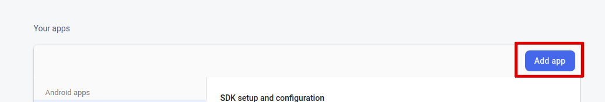

# legall_rimac_virtual

A new Flutter project.

## Getting Started

This project is a starting point for a Flutter application.

A few resources to get you started if this is your first Flutter project:

- [Lab: Write your first Flutter app](https://flutter.dev/docs/get-started/codelab)
- [Cookbook: Useful Flutter samples](https://flutter.dev/docs/cookbook)

For help getting started with Flutter, view our
[online documentation](https://flutter.dev/docs), which offers tutorials,
samples, guidance on mobile development, and a full API reference.

## Setup Firebase

To assign the Firebase account that we want to use, we must first register the Android application.

## Register the Android application
1. Go to [Firebase console](https://console.firebase.google.com/) and select the project to connect
2. Open project settings

3. Go to "Your apps" section and then click on Add app

4. Now select Android as your platform

5. Fill the Android package name field this should be "pe.com.legall.inspeccion" for this project
6. Give the app a nickname (If you want)
7. Click on "Register app"

8. Download the `google-services.json` file

This file should be placed on `android/app/google-services.json`

## Create a database
If you not have a database you will need create one

1. In the sidebar click on `Cloud Firestore`
2. Click on `Create database`

3. Select the start mode that you want and click `Next`

4. Select the desired location and click `Enable`

## Authentication
The application uses anonymous authentication so you need enable the sign-in method

1. Click `Authentication` on sidebar
2. Click `Sign-in method`
3. Switch on `Enable` on `Anonymous` sign-in method
4. Click `Save`

## Indexes
Two indexes are required for the application, both with scope `Collection`

1. Collection `chats` for fields:
    - `inspection_id` order `Ascending`
    - `datetime` order `Ascending`
2. Collection `photos` for fields:
    - `inspection_id` order `Ascending`
    - `type` order `Ascending`
    - `group` order `Descending`

To add a new index:

1. Click `Cloud Firestore` on sidebar
2. Click `Indexes` tab
3. Click `Add index`

## Setup Google Maps

The project require a `API KEY` for `Maps SDK for Android` so if you not have one will need create.

## Enable the API
1. Go to [Console](https://console.cloud.google.com/)
2. Select the project
3. Click `APIs & Services` on sidebar
4. Click `Dashboard`

5. Click `ENABLE APIS AND SERVICES`

6. Click `Maps SDK for Android`

7. Click `Enable`

## Create the API KEY

1. Click `APIs & Services` on sidebar
2. Click `Credentials`

3. Click `CREATE CREDENTIALS`
4. Click `API key`

5. Copy the API key from the dialog

## Setup API KEY

The `API key` should be set on the file `android/app/src/main/AndroidManifest.xml` as in the image

## Setup Azure Storage Account

The application use a Storage account and a `Shared access signature` (SAS) to access at the service.

If you not have a Storage account o need create one follow the next steps:

1. Go to `Panel` and click `Storage accounts`

2. Click `New` and fill the form, make sure that the account is StorageV2 on the `Account kind` field
3. Click Review + create button

4. Go to `Panel` and click on your new storage account
5. On sidebar click `Shared access signature`
6. Check `File` on `Allowed services` the other services are not needed but nothing happens if they are left checked
7. On `Allowed resource types` check all
8. Check the permissions as on the next image

9. Select the Start and expiry date/time, take into account that once the signature expires the app will not be able to connect with the service

10. Click `Generate SAS and connection string`
11. Copy the SAS token

12. On the project edit the file `lib/configuration.dart` change the `accountName` setting and paste the SAS token on the `SASToken` setting.
`Note: Please note that the SAS token obtained starts with the sign '?' skip it when pasting`

## Create the File shares
The project use two file shares `photos` and `videos` to create it

1. On sidebar click `File shares`
2. Click `+ File share`
3. Give a Name and Quota (make sure the name is exacly `photos` and `videos` respectively)
4. Click on `Create`

